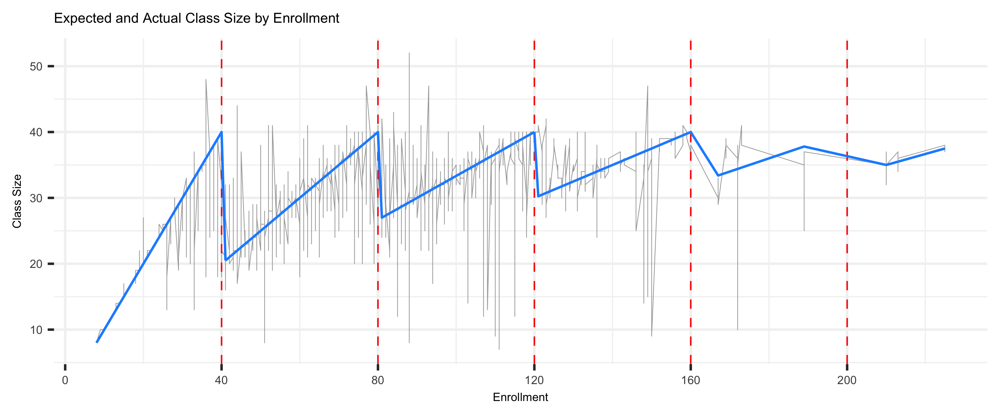
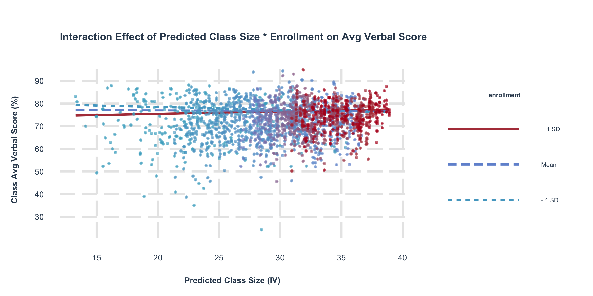

# Maimonides
- Playing around with the replication data for Angrist and Lavy's seminal 1999 QJE paper, "Using Maimonides' Rule to Estimate the Effect of Class Size on Scholastic Achievement". This was a brief final project I did for the course "Data Exploration" in my Masters program first semester. 
- Citation: Joshua D. Angrist, Victor Lavy. 1999. "Using Maimonides' Rule to Estimate the Effect of Class Size on Scholastic Achievement." The Quarterly Journal of Economics, 114(2), 533-575.

- Replicating the results of this paper on a small scale helped me gain deep conceptual understanding of causal inference, endogeneity and instrumental variable estimation (and appreciation for how difficult it is to find such IVs in the wild). I replicate the figure and analysis for fourth graders only. I do the Instrumental Variable (IV) estimation by writing my own R code for 2-stage least squares regression in Section 4. 

-   Data Source: https://dataverse.harvard.edu/dataset.xhtml?persistentId=doi:10.7910/DVN/XRSUJU.  
-   The data files (downloaded from Joshua Angrist's DataVerse page) are the files in this repository named "final4.csv" (data for 4th graders) and "final5.csv" (data for 5th graders). 
